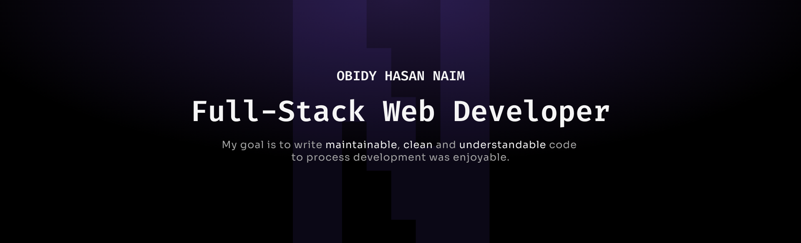

  

###

<h2 align="left">About me</h2>

###

Hi, I’m Obidy Hasan, a passionate Full-Stack MERN Developer. I specialize in building scalable, efficient, and user-friendly web applications by combining strong front-end design with powerful back-end functionality. On the front end, I craft responsive and engaging interfaces using React, Tailwind CSS, and JavaScript, while on the back end, I develop robust APIs and business logic with Node.js, Express.js, and MongoDB. I enjoy solving complex problems, optimizing performance, and turning ideas into practical solutions. My goal is to deliver clean, maintainable code and seamless digital experiences that have a lasting impact.

###

🖥️  See my portfolio at <a href="https://obidy-hasan.web.app/">obidyhasan</a> 📚 I'm currently learning <b>Next.JS</b> 💬 Ask me about React, Javascript, Frontend Technologies 🤝  I'm open to collaborating on interesting projects as a developer. 📫 How to reach me <a href="">obidyhasan@gmail.com</a>

###

<h2 align="left">Technologies I Use</h2>

###

                              

###

<h2 align="left">GitHub Streak Stats</h2>

###

  

###

<h2 align="left">Connect With Me</h2>

###

       

###
